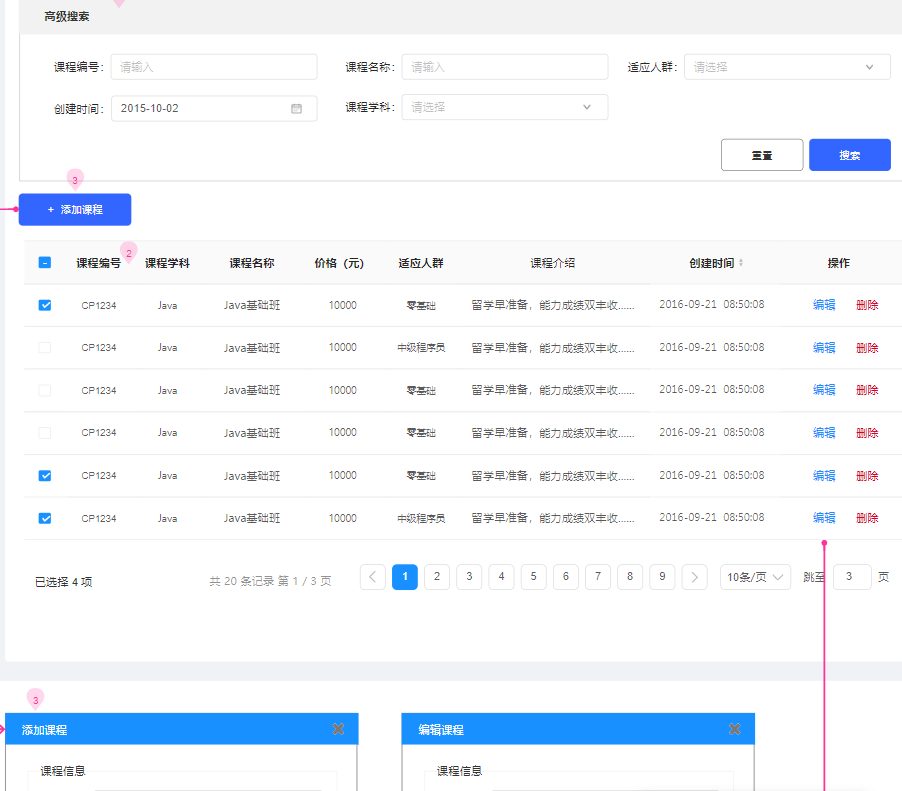
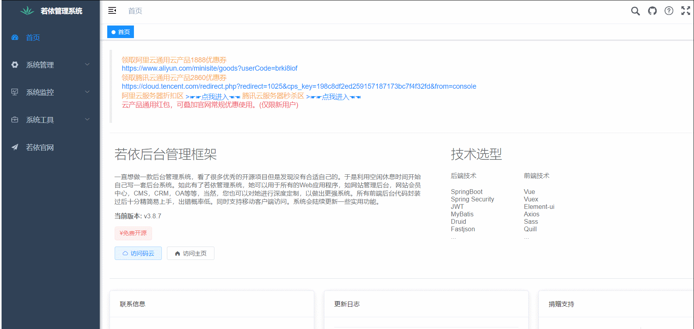
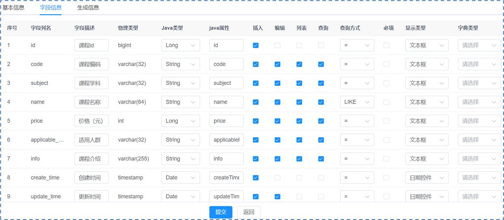
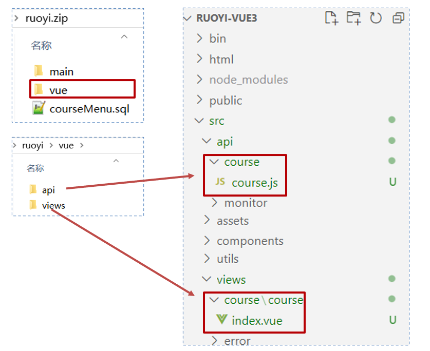
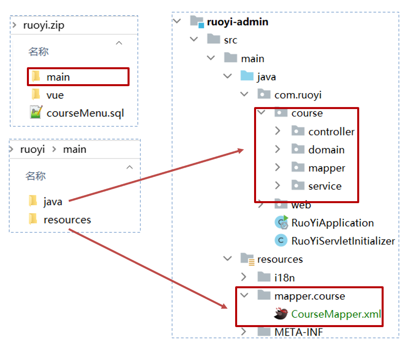

# 入门案例

若依项目成功搭建，深入了解其代码生成器功能，是掌握框架的重要一环。

接下来，将利用若依框架的代码生成器，实现 CRM 系统中的**课程管理**功能，

以实际体验并掌握如何在项目中有效使用这一工具。

## 一、需求设计和分析

CRM 系统中的课程管理功能，涵盖增加、删除、修改、查询课程信息的完整前后端代码。

[原型](https://app.mockplus.cn/run/prototype/_lwaPYSV9Ue6/byFT7QUzmCqJ/2AadzZnerRIDo?cps=collapse&isShare=true)如下图所示：



实现思路

1、准备课程表结构和数据 sql 文件，导入到数据库中；

2、登录系统（系统工具 -> 代码生成 -> 导入课程表）

3、代码生成列表中找到课程表（可预览、编辑、同步、删除生成配置）

4、点击生成代码会得到一个`ruoyi.zip`

5、执行 sql 文件导入菜单，按照包内目录结构复制到自己的项目中即可

## 二、功能实现

### 2.1.sql 脚本导入

导入准备好的 sql 文件，路径为：

isql/课程管理.sql

### 2.2.代码生成

Ⅰ、打开系统的前端页面 -> 左侧菜单 -> 系统工具 -> 代码生成

Ⅱ、点击“导入”，在导入表页面 -> 选择刚才 sql 脚本创建的 `tb_course` 数据库表 -> 确定

- 这步操作，将数据库表 `tb_course` 交给了若依框架的代码生成器进行管理。



Ⅲ、在选项列表页面点击 `tb_course` 这行记录的后方“操作”列的“编辑”按钮。

1. 点击“基本信息”选项卡，修改“实体表名称”、“作者”两项。
2. 点击“字段信息”选项卡，调整数据库表中的字段信息，以在后续生成的前端页面上，展示这些字段。
   - “字段列名”列与“实体属性”列一一对应。
   - “字段描述”列，对应前端列表页面展示的表头。
   - “物理类型”列与“Java属性”列，一般使用默认值即可。
   - “列表”列，表示该字段是否要在前端列表中展示（id 会自动展示）。
   - “查询”列，表示该字段是否可作为查询条件进行查询。
3. 点击“生成信息”选项卡，
   - “生成路径”，改为 `com.ruoyi.course`；
   - “模块名”，改为 `course`；
   - “上级菜单”，表示前端左侧菜单的位置，如果不选，默认就在“系统工具”下。
4. 点击“提交”



Ⅳ、在选项列表页面点击 `tb_course` 这行记录的后方“操作”列的“下载”按钮，会获得一个 zip 压缩包。

解压后，包含三部分内容如下；

├─📁 main/----------------------------------- # Java 后端代码
│ ├─📁 java/
│ │ └─📁 com/
│ │   └─📁 ruoyi/
│ │     └─📁 course/
│ │       ├─📁 controller/
│ │       │ └─📄 CourseController.java
│ │       ├─📁 domain/
│ │       │ └─📄 Course.java
│ │       ├─📁 mapper/
│ │       │ └─📄 CourseMapper.java
│ │       └─📁 service/
│ │         ├─📁 impl/
│ │         │ └─📄 CourseServiceImpl.java
│ │         └─📄 ICourseService.java
│ └─📁 resources/
│   └─📁 mapper/
│     └─📁 course/
│       └─📄 CourseMapper.xml
├─📁 vue/------------------------------------ # Vue 前端代码
│ ├─📁 api/
│ │ └─📁 course/
│ │   └─📄 course.js
│ └─📁 views/
│   └─📁 course/
│     └─📁 course/
│       └─📄 index.vue
└─📄 courseMenu.sql-------------------------- #  动态菜单的 sql 文件

将它们逐一导入到项目当中。

### 2.3.代码导入

#### 2.3.1.动态菜单的 sql 脚本导入

导入生成的 `courseMenu.sql` 脚本。

isql/courseMenu.sql

```mysql
-- 菜单 SQL
insert into sys_menu (menu_name, parent_id, order_num, path, component, is_frame, is_cache, menu_type, visible, status, perms, icon, create_by, create_time, update_by, update_time, remark)
values('课程管理', '0', '1', 'course', 'course/course/index', 1, 0, 'C', '0', '0', 'course:course:list', '#', 'admin', sysdate(), '', null, '课程管理菜单');

-- 按钮父菜单ID
SELECT @parentId := LAST_INSERT_ID();

-- 按钮 SQL
insert into sys_menu (menu_name, parent_id, order_num, path, component, is_frame, is_cache, menu_type, visible, status, perms, icon, create_by, create_time, update_by, update_time, remark)
values('课程管理查询', @parentId, '1',  '#', '', 1, 0, 'F', '0', '0', 'course:course:query',        '#', 'admin', sysdate(), '', null, '');

insert into sys_menu (menu_name, parent_id, order_num, path, component, is_frame, is_cache, menu_type, visible, status, perms, icon, create_by, create_time, update_by, update_time, remark)
values('课程管理新增', @parentId, '2',  '#', '', 1, 0, 'F', '0', '0', 'course:course:add',          '#', 'admin', sysdate(), '', null, '');

insert into sys_menu (menu_name, parent_id, order_num, path, component, is_frame, is_cache, menu_type, visible, status, perms, icon, create_by, create_time, update_by, update_time, remark)
values('课程管理修改', @parentId, '3',  '#', '', 1, 0, 'F', '0', '0', 'course:course:edit',         '#', 'admin', sysdate(), '', null, '');

insert into sys_menu (menu_name, parent_id, order_num, path, component, is_frame, is_cache, menu_type, visible, status, perms, icon, create_by, create_time, update_by, update_time, remark)
values('课程管理删除', @parentId, '4',  '#', '', 1, 0, 'F', '0', '0', 'course:course:remove',       '#', 'admin', sysdate(), '', null, '');

insert into sys_menu (menu_name, parent_id, order_num, path, component, is_frame, is_cache, menu_type, visible, status, perms, icon, create_by, create_time, update_by, update_time, remark)
values('课程管理导出', @parentId, '5',  '#', '', 1, 0, 'F', '0', '0', 'course:course:export',       '#', 'admin', sysdate(), '', null, '');
```

#### 2.3.2.前端代码导入

将 vue/api 包下的 course 目录，导入到前端 Vue 项目的 api 包下。

将 vue/views 包下的 course 目录，导入到前端 Vue 项目的 views 包下。



#### 2.3.3.后端代码导入

将 main/java/com/ruoyi/ 下的 course 包，导入到后端 ruoyi-admin/src/main/java/com/ruoyi 目录下。

将 main/resources/ 下的 mapper 包，导入到后端 ruoyi-admin/src/main/resources 目录下。



#### 2.3.4.项目重启

重启后端项目；

打开前端页面，发现左侧菜单中，新增了“课程管理“菜单。

进入”课程管理“，测试查询、新增等等功能。

