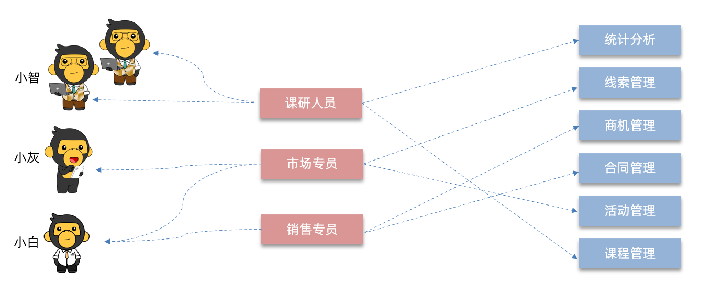

# 功能详解之系统管理之权限控制

若依提供了企业级通用权限系统，这里拿 CRM 系统演示下：[地址](https://huike-crm.itheima.net/)

- demo 账号（超级管理员），可以查看所有功能菜单；
- zhangsan 账号（市场专员），可以查看线索管理菜单；
- yueyue 账号（销售专员），可以查看商机、合同等菜单。

## 一、RBAC 的概念

RBAC（基于角色的访问控制）是一种广泛使用的访问控制模型，通过角色，来分配和管理用户的菜单权限。如下图所示：

由上图可知：

- 员工表、角色表之间是多对多关系；
- 角色表、菜单表之间是多对多关系；
- 所以 RBAC 至少需要 5 张数据库表。

## 二、若依中的 RBAC

若依中的 RBAC 实现，就用到了下表中加粗字体的 5 张表：

| 表名                | 说明           |
|-------------------|--------------|
| sys_dept          | 部门表          |
| sys_post          | 岗（职）位信息表     |
| **sys_menu**      | **菜单权限表**    |
| **sys_role**      | **角色信息表**    |
| sys_role_dept     | 角色和部门关联表     |
| **sys_role_menu** | **角色和菜单关联表** |
| **sys_user**      | **用户信息表**    |
| sys_user_post     | 用户与岗位关联表     |
| **sys_user_role** | **用户和角色关联表** |

这些表之间的关系，如下图所示：

若依支持粗粒度的权限控制：

- 粗粒度：员工根据不同角色，查看的菜单，有所区别。
- 细粒度：员工根据不同部门、岗位的设定，查看的信息也是有所区别的。

## 三、案例理解

创建新用户”小智“，关联”课研人员“的角色，登录后，仅能看见”课程管理“和”统计分析“菜单的访问。

### 3.1.菜单创建

> 若依中，菜单有三种类型：
>
> - 目录菜单（一级菜单），会展开二级菜单，并不会做路由跳转。
> - 页面菜单（二级菜单），点击后会跳转路由，即展示页面。
> - 按钮菜单（会话框），点击后是一个会话框（Dialog）。

Ⅰ、左侧菜单 -> 系统管理 -> 菜单管理；

Ⅱ、点击”新增“按钮，弹出会话框；

- “上级菜单”，选择“主类目”，表示与“系统管理”同级的目录；
- “菜单类型”，选择“目录”，表示是目录菜单（一级菜单）。
- “菜单图标”，选择一个图标；
- “菜单名称”，填写“统计分析”；
- “显示排序”，填写“1”；
- “是否外链”，表示当前目录是内部路由还是外部链接，这里选“否”；
- “路由地址”，非常重要，是页面组件之间的跳转方式，这里填“statistics”
- “显示状态”、“菜单状态”维持默认值。
- 点击确定。

Ⅲ、刷新页面，发现“统计分析”目录，已显示在左侧菜单。

Ⅳ、点击”新增“按钮，弹出会话框，再创建一个菜单；

- “上级菜单”，选择“统计分析”，即刚刚创建的“主类目”菜单。
- “菜单类型”，选择“菜单”，表示是一个页面菜单。
- “菜单图标”，选择一个图标；
- “菜单名称”，填写“客户统计”；
- “显示排序”，填写“1”；
- “是否外链”，表示当前目录是内部路由还是外部链接，这里选“否”；
- “路由地址”，非常重要，是页面组件之间的跳转方式，这里填“customer”
- “组件路径”，写一个路径完成页面展示，目前只演示权限控制，所以先随便填写一个"/abc"。
- “权限字符”、“路由参数”也暂时不填写。
- “显示状态”、“菜单状态”维持默认值。
- 点击确定。

Ⅴ、按照上面的步骤，以此类推，将“课程管理”菜单，设为“主类目”菜单

### 3.2.角色创建，并分配权限

Ⅰ、左侧菜单 -> 系统管理 -> 角色管理；

Ⅱ、点击”新增“按钮，弹出会话框；

- “角色名称”，填写“课研人员”；
- “权限字符”，与后台权限控制相关，先填写一个“research”
- “角色顺序”，填写“3”；
- “状态”，选择“正常”；
- “菜单权限”，选择“父子联动”
  - 勾选“课程管理”、”统计分析“
- 点击”确定“。

### 3.3.用户创建，并关联角色

Ⅰ、左侧菜单 -> 系统管理 -> 用户管理；

Ⅱ、点击”新增“按钮，弹出会话框；

- ”用户昵称“，填写”小智“；
- ”用户名称“，填写”xiaozhi“；
- ”用户密码“，填写”admin123“
- ”角色“，选择”课研人员“。

### 3.4.功能测试

退出当前用户，使用小智帐号登录；

发现左侧菜单，只有”课程管理“、”统计分析“可查看。
