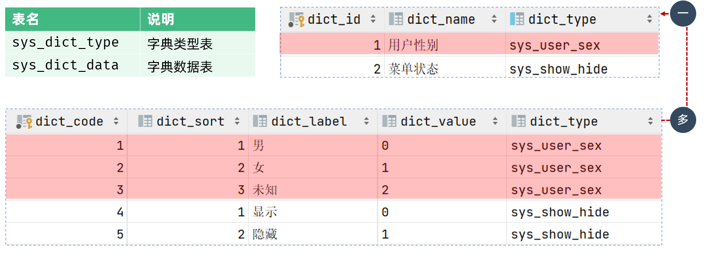

# 功能管理之系统管理之数据字典

## 一、若依中的数据字典

若依内置的数据字典，用于维护系统中常见的静态数据。比如：性别、状态…

功能包括：字典类型管理、字典数据管理

案例理解：修改若依字典的用户性别：

1. 左侧菜单 -> 系统管理 -> 字典管理
2. 找到“用户性别”行，点击“字典类型”列 sys_user_sex，进入字段数据页面。
3. 找到“男性”、“女性”行，点击后方的“操作”列中的“编辑”按钮，进行编辑。

### 1.1.数据库表结构

若依数据字典涉及两张数据库表，它们的关系是一对多。如下图所示：

## 二、案例理解

将”课程管理“的“学科”字段，改为数据字典。

### 2.1.添加字典类型和数据

Ⅰ、左侧菜单 -> 系统管理 -> 字典管理

Ⅱ、点击“新增”按钮；

- “字典名称”，填写“学科”；
- “字典类型”，填写“course_subject”
- “状态”，选择“正常”；
- “备注”，填写“课程学科”

Ⅲ、找到添加的“学科”字典，点击“字典类型”列的“course_subject”，进入“字典数据”页面。

Ⅳ、点击“新建”按钮：

- “数据标签”，填写“JavaEE”；
- “数据键值*，填写”0“；
- ”显示排序“，填写”0“；
- ”备注“，填写”JavaEE“；
- 其它为默认，点击”确定“。

依此类推，再添加”Python大数据“、”鸿蒙应用开发“两个课程，”数据键值“和”显示排序“依次增加。

### 2.2.修改代码生成信息

Ⅰ、左侧菜单 -> 系统工具 -> 代码生成

Ⅱ、点击“导入”，在导入表页面 -> 选择 `tb_course` 数据库表 -> 确定

- 这步操作，将数据库表 `tb_course` 交给了若依框架的代码生成器进行管理。

Ⅲ、在选项列表页面点击 `tb_course` 这行记录的后方“操作”列的“编辑”按钮。

- 点击”字段信息“选下卡；
- 找到”课程学科“行，将后方”显示类型“改为”下拉框；“字典类型”选择刚刚创建的“学科”。
- 点击“提交”

### 2.3.下载代码，导入前端

Ⅰ、回到“代码生成”页面，点击后方”操作“列的“生成代码”按钮，下载代码。

- 下载的代码，只需导入前端部分，后端部分没有变。

  > 新版 element-plus 没有默认宽度，要手动加宽度 `<el-select …… style="width: 240px;">`

刷新页面，进入“课程管理”菜单，发现“课程学科”菜单，变成了下拉框。

Ⅱ、将数据库表 `tb_course` 中，“JavaEE”改为“0”，Python大数据“改为”1“，”鸿蒙应用开发“改为”2“。