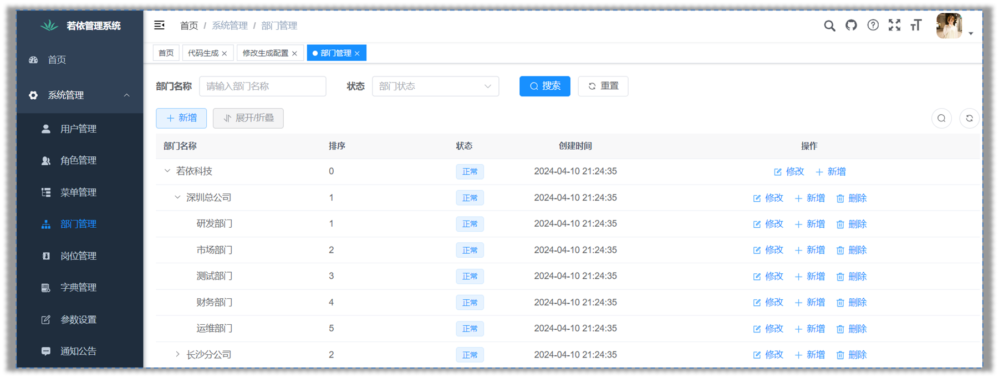

# 功能详解之系统工具之表单构建

## 一、表单构建

允许用户通过拖放等可视化操作，创建表单；

- 比如：用来收集数据的表格或调查问卷。

可以自定义表单的各个部分。

- 比如：添加不同的输入项和设置验证规则，无需编写代码。

提供了导出数据、导入数据、分享表单和设置权限的功能，方便数据管理和共享。

### 1.1.表单构建案例

案例理解：通过表单构建工具，单独制作一个添加课程的表单页面：

Ⅰ、制作并导出表单

- 使用拖、拉、拽的方式，配置可视化菜单。并配置右侧的“组件属性”、“表单属性”；

> 右侧“组件属性”中，“字段名”会用于 Vue 的双向绑定。应参考数据库表中的字段进行对应。

Ⅱ、代码导入到前端工程。

- 在”表单构建“页面，点击上方的”导出Vue文件“按钮。
  - ”生成类型“，选择”页面“；
  - 点击“确定”。
- 将导出的文件，改名为 `add.vue`。
- 将该文件，放入前端 Vue 工程的 `views/course/course/` 包下。

Ⅲ、创建动态菜单

- 左侧菜单 -> 系统管理 -> 菜单管理。
- 点击“新建”按钮，打开会话框。
- “菜单类型”，选择“目录”；
- “菜单图标”，选择一个图标。
- “菜单名称”，填写“添加课程”；
- “显示排序”，输入“1”；
- “**路由地址**”，填写“`course/add`”，用于前端路由页面跳转。
- “**组件路径**”，填写“`course/course/add`”，不能随便写，要参考前端工程 `views` 包下的目录结构。表示由“路由地址”跳转到的组件。
- 点击“确定”。

刷新页面，发现左侧菜单在，新增了“添加课程”菜单。

至此，前端就可以之间访问添加课程的表单页面了

## 二、代码生成

前面的入门案例中，我们已经体验过导入数据库表，自动生成前后端代码的功能。

- 其中包括数据库操作类、后端控制器、前端页面等等。

若依支持根据数据库的表结构，反向生成代码，减少手动编写的工作量。

若依提供三种生成模板：**单表**、 **树表**、**主子表**（一对多）；

- 可以生成适用于 Spring Boot、MyBatis 等流行框架的代码，提高开发效率和代码质量。

**单表**在入门案例中，已经使用过。

### 2.1.树表的介绍

**树表**是一种展示层级数据的表格，能展开折叠，清晰呈现父子关系，便于管理。

- 比如：部门管理中，多个部门的层级关系，如下图所示。



Ⅰ、左侧菜单 -> 系统工具 -> 代码生成。

Ⅱ、点击“导入”按钮，将 `sys_dept` 表导入。

Ⅲ、在 sys_dept 后方“操作”列，点击“编辑”按钮，进入“修改生成配置”页面。

Ⅳ、点击“生成信息”选项卡。

- “生成模板”，选择“树表（增删改查）”
- 会发现，下方“其它信息”部分，多出了“树编码字段”、“树父编码字段”、“树名称字段”。

“树编码字段”，就是当前树表（`sys_dept`）的主键，即 `dept_id` 字段。

“树父编码字段”，对应当前树表（`sys_dept`）的 `parent_id` 字段。

“树名称字段”，是最终展示在前端页面的，所以是当前树表（`sys_dept`）的  `dept_name` 字段。

Ⅴ、选好后，点击”提交“；

Ⅵ、在”代码生成“页面，下载 sys_dept 的代码，展示的效果，是与部门管理页面的列表完全一致的。

## 三、系统接口

Swagger，能够自动生成 API 的同步在线文档，并提供 Web 界面进行接口调用和测试。

使用时，要将 token 放入 Authorize 中。

并调整配置文件中的配置，取消下方 pathMapping 中的 `/dev-api`

ruoyi-admin/src/main/resources/application.yml

```yaml
# Swagger配置
swagger:
  # 是否开启swagger
  enabled: true
  # 请求前缀
  pathMapping:
```
