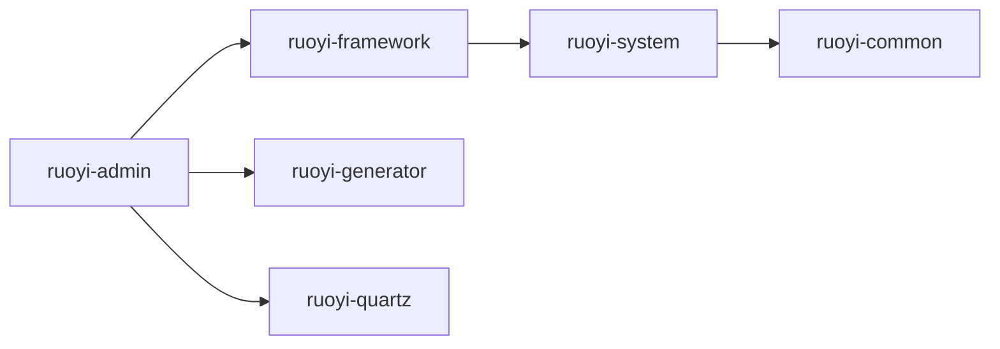
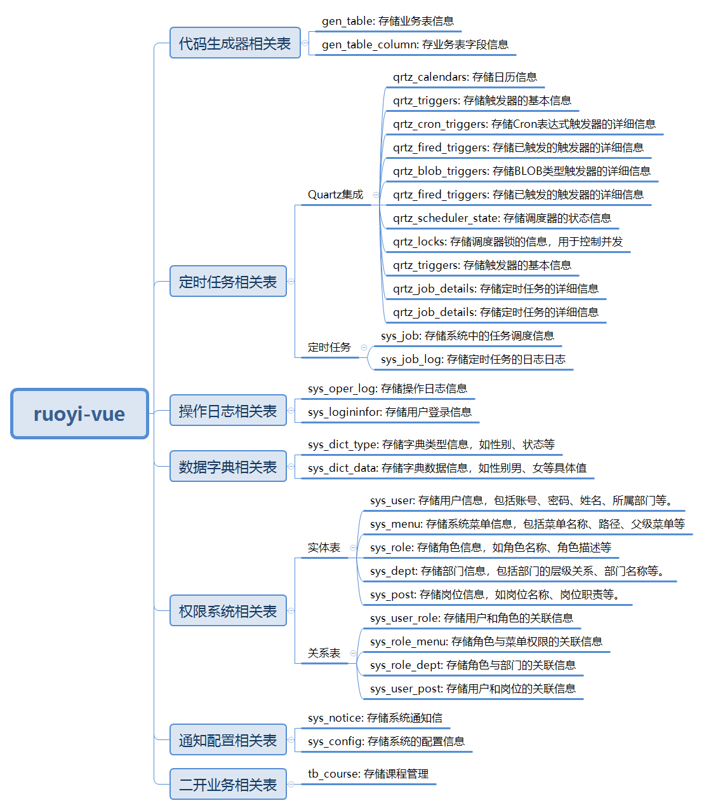

# 项目结构

在上文功能的讲解过程中，涉及的前后端项目结构、配置文件，还比较陌生。

所以接下来，我们开始进入项目结构这部分内容的介绍。

## 一、后端模块

后端工程结构，如下图所示

├─📁 .github/
├─📁 bin/
├─📁 doc/
├─📁 isql/
├─📁 Note/
├─📁 ruoyi-admin/-------- # 后台服务
├─📁 ruoyi-common/------- # 通用工具
├─📁 ruoyi-framework/---- # 核心框架
├─📁 ruoyi-generator/---- # 代码生成（可移除）
├─📁 ruoyi-quartz/------- # 定时任务（可移除）
├─📁 ruoyi-system/------- # 系统模块
├─📁 ruoyi-ui/
├─📁 sql/
├─📄 .gitignore
├─📄 LICENSE
├─📄 pom.xml
├─📄 README.md
├─📄 ry.bat
└─📄 ry.sh

各模块之间的依赖关系，如下图所示：



### 1.1.ruoyi-admin

ruoyi-admin，是后台服务模块，是后端服务的入口。

├─📁 src
│ └─📁 main
│   ├─📁 java
│   │ └─📁 com
│   │   └─📁 ruoyi
│   │     ├─📁 course
│   │     │ ├─📁 controller
│   │     │ ├─📁 domain
│   │     │ ├─📁 mapper
│   │     │ └─📁 service
│   │     ├─📁 web----------------------------- # 通用功能的 controller 包
│   │     │ ├─📁 controller
│   │     │ └─📁 core
│   │     ├─📄 RuoYiApplication.java----------- # 项目启动类
│   │     └─📄 RuoYiServletInitializer.java---- # 项目启动类（用于打 war 包）
│   └─📁 resources
├─📁 target
└─📄 pom.xml

web 包下，有后台登录、权限控制、数据字典相关的 controller 类，用于接收前端请求，做出响应。

`RuoYiServletInitializer.java` 启动类，会将 ruoyi 工程打成一个 war 包，使用外置的 servlet 容器来运行。

### 1.2.ruoyi-common

ruoyi-common，是通用工具模块

├─📁 src
│ └─📁 main
│   └─📁 java
│     └─📁 com
│       └─📁 ruoyi
│         └─📁 common
│           ├─📁 annotation---- # 自定义注解
│           ├─📁 config-------- # 全局配置
│           ├─📁 constant------ # 通用常量
│           ├─📁 core---------- # 核心控制
│           ├─📁 enums--------- # 通用枚举
│           ├─📁 exception----- # 通用异常
│           ├─📁 filter-------- # 过滤器处理
│           ├─📁 utils--------- # 通用工具类
│           └─📁 xss----------- # 自定义 xss 校验
├─📁 target
└─📄 pom.xml

xss 指的是跨站脚本工具

以后写的所有 Controller，都要继承 com.ruoyi.common.core.controller.BaseController 类

返回结果类的封装：com.ruoyi.common.core.domain.AjaxResult

基础实体类的封装：com.ruoyi.common.core.domain.BaseEntity

### 1.3.ruoyi-framework

ruoyi-framework。是核心框架模块

├─📁 src
│ └─📁 main
│   └─📁 java
│     └─📁 com
│       └─📁 ruoyi
│         └─📁 framework
│           ├─📁 aspectj-------- # 自定义 AOP
│           ├─📁 config--------- # 系统配置
│           ├─📁 datasource----- # 多数据源
│           ├─📁 interceptor---- # 拦截器处理
│           ├─📁 manager-------- # 异步处理
│           ├─📁 security------- # 权限控制
│           └─📁 web------------ # 前端控制
├─📁 target
└─📄 pom.xml

### 1.4.ruoyi-system

ruoyi-system，是系统模块。与后台服务模块结合使用。

├─📁 src
│ └─📁 main
│   ├─📁 java
│   │ └─📁 com
│   │   └─📁 ruoyi
│   │     └─📁 system
│   │       ├─📁 domain
│   │       ├─📁 mapper
│   │       └─📁 service
│   └─📁 resources
├─📁 target
└─📄 pom.xml

### 1.5.其它模块

ruoyi-generator，是代码生成模块；ruoyi-quartz，是定时任务模块，它们可以从项目中移除，但它们功能非常强大，一般会保留下来。

ruoyi-ui 是前端模块。

## 二、后端配置文件

后端项目中的配置文件，都在 ruoyi-admin 模块下，如下图：

├─📁 i18n--------------------- # 国际化处理
├─📁 mapper
├─📁 META-INF----------------- # 存储了项目的元信息（*描述数据的数据*），无需修改
├─📁 mybatis------------------ # mybatis 相关的配置信息
├─📄 application-dev.yml
├─📄 application-druid.yml---- # 数据库连接配置
├─📄 application.yml---------- # 项目中的核心配置
├─📄 banner.txt--------------- # 默认的 banner 图标信息，项目启动，控制台打印显示
└─📄 logback.xml-------------- # 日志配置

application.yml 是项目核心配置，下面重点介绍

### 2.1.项目信息配置

ruoyi-admin/src/main/resources/application.yml

```yaml
# 项目相关配置
ruoyi:
  # 名称
  name: RuoYi
  # 版本
  version: 3.8.8
  # 版权年份
  copyrightYear: 2024
  # 文件路径 示例（ Windows配置D:/ruoyi/uploadPath，Linux配置 /home/ruoyi/uploadPath）
  profile: D:/ruoyi/uploadPath
  # 获取ip地址开关
  addressEnabled: false
  # 验证码类型 math 数字计算 char 字符验证
  captchaType: math
```

### 2.2.开发环境配置

ruoyi-admin/src/main/resources/application.yml

```yaml
# 开发环境配置
server:
  # 服务器的HTTP端口，默认为8080
  port: 8080
  servlet:
    # 应用的访问路径
    context-path: /
  tomcat:
    # tomcat的URI编码
    uri-encoding: UTF-8
    # 连接数满后的排队数，默认为100
    accept-count: 1000
    threads:
      # tomcat最大线程数，默认为200
      max: 800
      # Tomcat启动初始化的线程数，默认值10
      min-spare: 100
```

### 2.3.日志配置

ruoyi-admin/src/main/resources/application.yml

```yaml
# 日志配置
logging:
  level:
    com.ruoyi: debug
    org.springframework: warn
```

- 项目上线后，com.ruoyi 可改为 info 级别的日志输出

### 2.4.用户配置

ruoyi-admin/src/main/resources/application.yml

```yaml
# 用户配置
user:
  password:
    # 密码最大错误次数
    maxRetryCount: 5
    # 密码锁定时间（默认10分钟）
    lockTime: 10
```

### 2.5.Spring 相关配置

ruoyi-admin/src/main/resources/application.yml

```yaml
# Spring配置
spring:
  # 资源信息
  messages:
    # 国际化资源文件路径
    basename: i18n/messages
  profiles:
    active: druid
  # 文件上传
  servlet:
    multipart:
      # 单个文件大小
      max-file-size: 10MB
      # 设置总上传的文件大小
      max-request-size: 20MB
  # 服务模块
  devtools:
    restart:
      # 热部署开关
      enabled: true
  # redis 配置
  redis:
    # 地址
    host: localhost
    # 端口，默认为6379
    port: 6379
    # 数据库索引
    database: 0
    # 密码
    password:
    # 连接超时时间
    timeout: 10s
    lettuce:
      pool:
        # 连接池中的最小空闲连接
        min-idle: 0
        # 连接池中的最大空闲连接
        max-idle: 8
        # 连接池的最大数据库连接数
        max-active: 8
        # #连接池最大阻塞等待时间（使用负值表示没有限制）
        max-wait: -1ms
```

国际化：将下方文件中的文字，改为对应国家的语言，即可做相应的提示：

ruoyi-admin/src/main/resources/i18n/messages.properties

### 2.6.令牌配置

ruoyi-admin/src/main/resources/application.yml

```yaml
# token配置
token:
  # 令牌自定义标识
  header: Authorization
  # 令牌密钥
  secret: xxxxxx
  # 令牌有效期（默认30分钟）
  expireTime: 30
```

### 2.7.Mbatis 和 PageHelper 配置

ruoyi-admin/src/main/resources/application.yml

```yaml
# MyBatis配置
mybatis:
  # 搜索指定包别名
  typeAliasesPackage: com.ruoyi.**.domain
  # 配置mapper的扫描，找到所有的mapper.xml映射文件
  mapperLocations: classpath*:mapper/**/*Mapper.xml
  # 加载全局的配置文件
  configLocation: classpath:mybatis/mybatis-config.xml

# PageHelper分页插件
pagehelper:
  helperDialect: mysql
  supportMethodsArguments: true
  params: count=countSql
```

### 2.8.防止跨站脚本攻击配置

ruoyi-admin/src/main/resources/application.yml

```yaml
# 防止XSS攻击
xss:
  # 过滤开关
  enabled: true
  # 排除链接（多个用逗号分隔）
  excludes: /system/notice
  # 匹配链接
  urlPatterns: /system/*,/monitor/*,/tool/*
```

## 三、前端项目结构

前端项目结构如下所示：

├─📁 bin----------------- # 执行脚本
├─📁 html---------------- # IE 低版本提示页
├─📁 public-------------- # 公共资源
├─📁 src----------------- # 源代码
│ ├─📁 api--------------- # 所有请求
│ ├─📁 assets------------ # 静态资源
│ ├─📁 components-------- # 全局公用组件
│ ├─📁 directive--------- # 全局指令
│ ├─📁 layout------------ # 布局
│ ├─📁 plugins----------- # 通用插件
│ ├─📁 router------------ # 路由配置
│ ├─📁 store------------- # 状态管理
│ ├─📁 utils------------- # 全局公用方法
│ ├─📁 views------------- # 视图组件
│ ├─📄 App.vue----------- # 入口组件
│ ├─📄 main.js----------- # 入口文件
│ ├─📄 permission.js----- # 权限管理
│ └─📄 settings.js------- # 系统配置
├─📁 vite---------------- # 构建工具
├─📄 .env.development---- # 开发环境配置
├─📄 .env.production----- # 生产环境配置
├─📄 .env.staging-------- # 测试环境配置
├─📄 .gitignore
├─📄 index.html---------- # 入口页面
├─📄 LICENSE
├─📄 package.json-------- # 项目配置文件（相当于pom.xml）
├─📄 pnpm-lock.yaml
├─📄 README.md
└─📄 vite.config.js------ # Vue 项目的配置信息（相当于 application.yml）

以后的二次开发，会重点接触 api、views、router 包下的文件。

## 四、数据库表结构

### 4.1.代码生成

| 表名             | 说明               |
| ---------------- | ------------------ |
| gen_table        | 代码生成业务表     |
| gen_table_column | 代码生成业务表字段 |

### 4.2.数据字典

| 表名          | 说明       |
| ------------- | ---------- |
| sys_dict_data | 字典数据表 |
| sys_dict_type | 字典类型表 |

### 4.3.定时任务

| 表名        | 说明               |
| ----------- | ------------------ |
| sys_job     | 定时任务调度表     |
| sys_job_log | 定时任务调度日志表 |

### 4.4.日志

| 表名           | 说明         |
| -------------- | ------------ |
| sys_logininfor | 系统访问记录 |
| sys_oper_log   | 操作日志记录 |

### 4.5.通知配置

| 表名       | 说明       |
| ---------- | ---------- |
| sys_notice | 通知公告表 |
| sys_config | 参数配置表 |

### 4.6.权限

| 表名          | 说明             |
| ------------- | ---------------- |
| sys_menu      | 菜单权限表       |
| sys_dept      | 部门表           |
| sys_post      | 岗位信息表       |
| sys_role      | 角色信息表       |
| sys_role_dept | 角色和部门关系表 |
| sys_role_menu | 角色和菜单表     |
| sys_user      | 用户信息表       |
| sys_user_post | 用户与岗位关联表 |
| sys_user_role | 用户和角色关联表 |

它们之间的关系，如下图所示：

