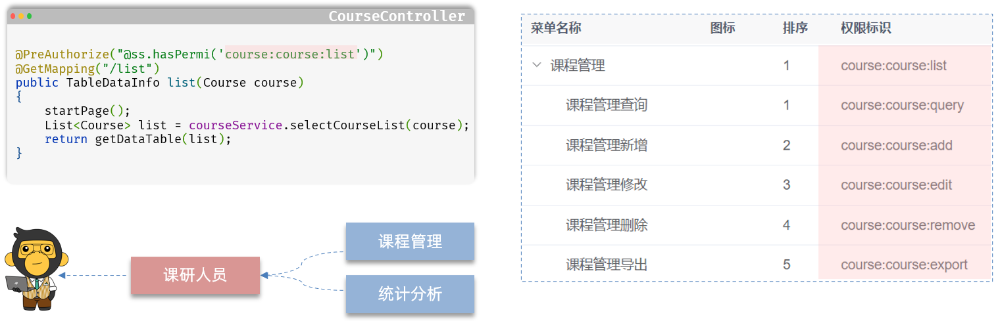

# 源码阅读之课程管理

## 一、前端源码阅读

课程管理模块，前端自动生成的代码，包含两个文件：

- src/views/course/course/index.vue，页面组件文件
- src/api/course/course.js，发送请求的文件。

### 1.1.页面组件

src/views/course/course/index.vue

```vue
<!-- 新增按钮 -->
<el-col :span="1.5">
  <el-button
    type="primary"
    plain
    icon="Plus"
    @click="handleAdd"
    v-hasPermi="['course:course:add']"
  >新增</el-button>
</el-col>
```

- `v-hasPermi` 是一个自定义属性，结合 RBAC 权限控制模型，来控制按钮的显示或隐藏。

src/views/course/course/index.vue

```vue
<!-- 列表上方按钮 -->
<right-toolbar v-model:showSearch="showSearch" @queryTable="getList"></right-toolbar>
```

- `<right-toolbar>` 是自定义组件。第一个按钮，用来控制搜索栏的显示或隐藏；第二个按钮，会触发查询事件更新表格数据。

src/views/course/course/index.vue

```vue
<!-- 列表体 -->
<el-table v-loading="loading" :data="courseList" @selection-change="handleSelectionChange">
  <el-table-column type="selection" width="55" align="center" />
  <el-table-column label="课程id" align="center" prop="id" />
  <el-table-column label="课程编码" align="center" prop="code" />
  <el-table-column label="课程学科" align="center" prop="subject">
    <template #default="scope">
      <dict-tag :options="course_subject" :value="scope.row.subject"/>
    </template>
  </el-table-column>
  <el-table-column label="课程名称" align="center" prop="name" />
  <el-table-column label="价格" align="center" prop="price" />
  <el-table-column label="适用人群" align="center" prop="applicablePerson" />
  <el-table-column label="课程介绍" align="center" prop="info" />
  <el-table-column label="操作" align="center" class-name="small-padding fixed-width">
    <template #default="scope">
      <el-button link type="primary" icon="Edit" @click="handleUpdate(scope.row)" v-hasPermi="['course:course:edit']">修改</el-button>
      <el-button link type="primary" icon="Delete" @click="handleDelete(scope.row)" v-hasPermi="['course:course:remove']">删除</el-button>
    </template>
  </el-table-column>
</el-table>
```

- `<el-table>` 标签的 `v-loading` 指令，用于展示加载状态，提升用户体验。
- `<el-table>` 标签的`:data` 属性，用于指定列表数据的数据源。
- `<el-table>` 标签的 `@selection-change`  事件，用于监听列表行的选中事件。
- `<dict-tag>` 组件，用于匹配数据字典，将字典值与字典标签对应。
- `v-hasPermi` 是自定义权限相关的指令。

src/views/course/course/index.vue

```javascript
const { proxy } = getCurrentInstance();

// 引入后端api接口
import { listCourse, getCourse, delCourse, addCourse, updateCourse } from "@/api/course/course";
// 获取当前实例代理对象，用于访问组件数据、方法
const { proxy } = getCurrentInstance();
// 获取课程学科的数据字典
const { course_subject } = proxy.useDict('course_subject');
// 列表数据
const courseList = ref([]);
// 是否显示弹框
const open = ref(false);
// 是否显示加载状态
const loading = ref(true);
// 是否显示搜索栏
const showSearch = ref(true);
// 复选框，被选中id的数组
const ids = ref([]);
// 复选框，是否单选，用于高亮修改、删除按钮
const single = ref(true);
// 复选框，是否多选，仅高亮删除按钮
const multiple = ref(true);
// 总（记录）条数
const total = ref(0);
// 用于区分新增、修改对话框标题
const title = ref("");
```

- `proxy` 用于获取当前实例代理对象，用于访问组件数据，方法。

### 1.2.发送请求

src/api/course/course.js

```javascript
import request from '@/utils/request'

// 查询课程管理列表
export function listCourse(query) {
  return request({
    url: '/course/course/list',
    method: 'get',
    params: query
  })
}

// 查询课程管理详细
export function getCourse(id) {
  return request({
    url: '/course/course/' + id,
    method: 'get'
  })
}

// 新增课程管理
export function addCourse(data) {
  return request({
    url: '/course/course',
    method: 'post',
    data: data
  })
}

// 修改课程管理
export function updateCourse(data) {
  return request({
    url: '/course/course',
    method: 'put',
    data: data
  })
}

// 删除课程管理
export function delCourse(id) {
  return request({
    url: '/course/course/' + id,
    method: 'delete'
  })
}
```

## 二、后端源码阅读

### 2.1.CourseController 类

ruoyi-admin/src/main/java/com/ruoyi/course/controller/CourseController.java

```java
……

/**
 * 课程管理Controller
 * 
 * @author zetian
 * @date 2024-11-22
 */
@RestController
@RequestMapping("/course/course")
public class CourseController extends BaseController
{
    @Autowired
    private ICourseService courseService;

    /**
     * 查询课程管理列表
     */
    @PreAuthorize("@ss.hasPermi('course:course:list')")
    @GetMapping("/list")
    public TableDataInfo list(Course course)
    {
        // 1.开启分页
        startPage();
        // 2.查询课程列表
        List<Course> list = courseService.selectCourseList(course);
        // 3.表格分页数据对象
        return getDataTable(list);
    }
  
    ……
}
```

- `@Log` 注解，用于记录用户的操作日志；原理是 Spring AOP 和异步管理器，后续详细介绍
- `@PreAuthorize` 注解，是 Spring Security 安全框架的注解，用于做权限控制。

### 2.2.BaseController 类

`CourseController` 类继承了 `BaseController` 类；

`BaseController` 用于 Web 通用数据处理：

其中 `BaseController` 详细定义如下图：

ruoyi-common/src/main/java/com/ruoyi/common/core/controller/BaseController.java


### 2.3.TableDataInfo 类

分页查询统一返回对象：表格分页数据对象

ruoyi-common/src/main/java/com/ruoyi/common/core/page/TableDataInfo.java


### 2.4.AjaxResult 类

增删改查操作，统一返回对象：操作消息提醒：

ruoyi-common/src/main/java/com/ruoyi/common/core/domain/AjaxResult.java


### 2.5.BaseEntity 类

所有实体类默认继承的 BaseEntity 基类：

ruoyi-common/src/main/java/com/ruoyi/common/core/domain/BaseEntity.java


### 2.6.@PreAuthorize 注解

`@PreAuthorize` 注解是 Spring Security 框架中用来做权限检查的。

它在运行方法前先验证权限，权限够就放行，不够就拦截。



用户登录后的权限控制流程图如下所示：


用户访问某一个功能，进行权限校验的流程如下所示：


## 三、跨域的处理

在前端开发中，跨域是一个常见的问题；

跨域是指在浏览器中，发送的 AJAX 请求的目标地址，与当前页面的地址不在同一个域下，这会导致浏览器的同源策略产生限制，从而阻止了跨域请求的发送。

我们可以通过前端工程的代理服务器来解决这个问题。

- 代理服务器是位于客户端和目标服务器之间的一台服务器;
- 它接收客户端发送的请求，并将请求转发给目标服务器。
- 通过在代理服务器上进行请求转发，可以绕过浏览器的同源策略限制，从而实现跨域请求。

在前端工程 vue.config.js 文件中添加以下内容：

vite.config.js

```js
server: {
  port: 80,
  host: true,
  open: true,
  proxy: {
    '/dev-api': {
      target: 'http://localhost:8080',
      changeOrigin: true,
      rewrite: (p) => p.replace(/^\/dev-api/, '')
    }
  }
},
```


