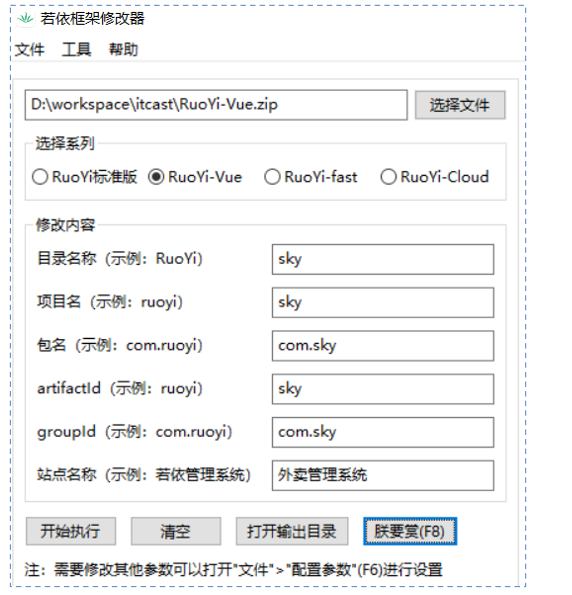
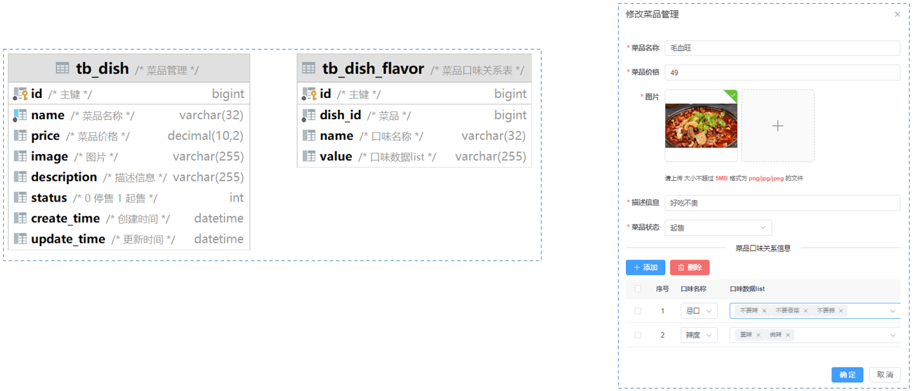

# 二次开发

接下来，实现外卖管理系统的业务功能开发；

本章培养的是大家如何基于若依进行二次开发的技能，所以这里我们拿其中一个菜品管理功能进行介绍

## 一、模块定制

[若依框架修改器](https://gitee.com/lpf_project/RuoYi-MT/releases)，是一个可以一键修改 RuoYi 框架包名、项目名的工具。



这里作为演示项目，就不改名了。

## 二、新建业务模块

### 2.1.新建子模块

第一步，创建模块，选择 Maven ，点击 Next

1. 进入 Project Structure => Moudule => + 号 => New Module => java
2. 在右侧 Build system 选择 Maven。

第二步，填写模块名称，坐标信息，点击 finish，创建完成。

1. 在右侧打开 Advanced Setting，配置 GroupId，ArtifactId，version；它们分别表示组织名，模块名，版本号。这也被称为 maven 中的**坐标**。比如：

   - GroupId，设为 com.ruoyi；

   - ArtifactId，设为 sky-merchant；

   - version 有 IDEA 自动生成，创建时无需指定。

2. 配置完成后，点击 Create 创建项目。maven 会自动加载项目所依赖的插件，放入本地仓库中。

3. 创建完成后，会发现 test 目录下，没有 resource 目录，这是因为它们不常用，需要的话要手动创建。

### 2.2.引入 ruoyi-framework

在新建的子模块的 pom.xml 文件中，引入若依的核心模块 `ruoyi-framework` 的坐标。

sky-merchant/pom.xml

```xml
<dependencies>
    <!-- 核心模块 -->
    <dependency>
        <groupId>com.ruoyi</groupId>
        <artifactId>ruoyi-framework</artifactId>
    </dependency>
</dependencies>
```

### 2.2.版本锁定

在 `RuoYi-Vue` 父工程 `pom.xml` 中进行版本锁定。

pom.xml

```xml
<!-- 依赖声明 -->
<dependencyManagement>
    <dependencies>
        <dependency>
            <groupId>com.ruoyi</groupId>
            <artifactId>sky-merchant</artifactId>
            <version>${ruoyi.version}</version>
        </dependency>
    </dependencies>
</dependencyManagement>
```

### 2.3.添加到 sky-merchant

在`ruoyi-admin` 模块 `pom.xml`中添加模块依赖。

ruoyi-admin/pom.xml

```xml
<dependency>
    <groupId>com.ruoyi</groupId>
    <artifactId>sky-merchant</artifactId>
</dependency>
```

## 三、菜品管理

利用若依代码生成器（主子表模板），生成菜品管理的前后端代码。

新增、修改、删除涉及到两张表的操作，分别是菜品表（`tb_dish`）、口味表（`tb_flavor`）。

它们的关系是一对多。

它们的表结构与页面原型如下：



### 3.1.SQL 导入

将菜品表（`tb_dish`）和口味表（`tb_dish_flavor`）的 SQL 脚本，导入到数据库中。

isql/菜品管理.sql

### 3.2.代码生成

#### 3.2.1.数据字典设置

添加“售卖状态”的数据字典：

Ⅰ、左侧菜单 -> 系统管理 -> 字典管理

Ⅱ、点击“新增”按钮；

- “字典名称”，填写“售卖状态”；
- “字典类型”，填写“dish_status”
- “状态”，选择“正常”；
- “备注”，填写“售卖状态”

Ⅲ、找到添加的“售卖状态”字典，点击“字典类型”列的“dish_status”，进入“字典数据”页面。

Ⅳ、点击“新建”按钮：

- “数据标签”，填写“停售”；
- “数据键值*，填写”0“；
- ”显示排序“，填写”1“；
- ”备注“，填写”停售“；
- 其它为默认，点击”确定“。

依此类推，再添加”起售“。

#### 3.2.2.代码生成设置

在选项列表页面点击 `tb_dish` 这行记录的后方“操作”列的“编辑”按钮。

1. 点击“基本信息”选项卡，修改“实体表名称”、“作者”两项。
2. 点击“字段信息”选项卡，调整数据库表中的字段信息，以在后续生成的前端页面上，展示这些字段。
   - “字段列名”列与“java属性”列一一对应。
   - “字段描述”列，对应前端列表页面展示的表头。
   - “物理类型”列与“Java类型”列，一般使用默认值即可。
   - “列表”列，表示该字段是否要在前端列表中展示（id 字段会自动展示）。
   - “查询”列，表示该字段是否可作为查询条件进行查询。在后端的动态 SQL 中添加。
3. 点击“生成信息”选项卡，
   - “生成模板”，选择“主子表”
   - “生成包路径”，改为 `com.sky.merchant`；
   - “生成模块名”，改为 `merchant`；
   - “生成业务名“，改为 `dish`；
   - “上级菜单”，表示前端左侧菜单的位置，如果不选，默认就在“系统工具”下。
   - “关联子表的表名”，选择“tb_dish_flavor”；
   - “子表关联的外键名”，选择“dish_id”
4. 点击“提交”

> 利用若依的主子表模板，生成菜品管理的前后端代码。

在选项列表页面点击 `tb_dish_flavor` 这行记录的后方“操作”列的“编辑”按钮。

1. 点击“基本信息”选项卡，修改“实体表名称”、“作者”两项。
2. 点击“提交”。

#### 3.2.3.代码下载

在选项列表页面，分别点击 `tb_dish`、`tb_dish_flavor` 这两行记录的后方“操作”列的“下载”按钮，会获得一个 zip 压缩包。

解压后，包含后端代码、前端代码、动态菜单 sql 文件三部分内容，如下所示；

#### 3.2.4.代码导入

下载下来的代码 zip 包，解压后其中包含三部分内容：

- 动态菜单 sql 脚本；
- 前端代码；
- 后端代码；

将他们分别导入到项目中。

在父工程中，执行 Maven 的 clean 生命周期。

重启项目，发现左侧菜单中，增加了“菜品管理”菜单。

测试菜品管理的增、删、改、查功能。

### 3.3.菜品管理前端页面优化

在菜品管理页面，将“主键”这一列去掉。

src/views/merchant/dish/index.vue

```vue
<!-- <el-table-column label="主键" align="center" prop="id" /> -->
```

在菜品管理页面，将“售价”这一列的值前，加“￥”符号

src/views/merchant/dish/index.vue

```vue
<el-table-column label="售价" align="center">
  <template #default="scope">
    <div>
      ￥{{ scope.row.price }}
    </div>
  </template>
</el-table-column>
```

在菜品管理页面，将“更新时间”这一列的值的后面，加时、分、秒

src/views/merchant/dish/index.vue

```vue
<el-table-column label="更新时间" align="center" prop="updateTime" width="180">
  <template #default="scope">
    <span>{{ parseTime(scope.row.updateTime, '{y}-{m}-{d} {h}:{i}:{s}') }}</span>
  </template>
</el-table-column>
```

修改菜品时，存储在阿里云 OSS 上的图片，无法显示，修复这个 bug。

- 阿里云 OSS 上的图片，通常是一个完整的图片路径，其中包含“http”字符串。
- 满足以上条件的图片，不拼接 baseUrl 即可。

src/components/ImageUpload/index.vue

```js
watch(() => props.modelValue, val => {
  if (val) {
    // 首先将值转为数组
    const list = Array.isArray(val) ? val : props.modelValue.split(",");
    // 然后将数组转为对象数组
    fileList.value = list.map(item => {
      if (typeof item === "string") {
        if (item.indexOf(baseUrl) === -1 && !item.includes("http")) {
          item = { name: baseUrl + item, url: baseUrl + item };
        } else {
          item = { name: item, url: item };
        }
      }
      return item;
    });
  } else {
    fileList.value = [];
    return [];
  }
},{ deep: true, immediate: true });
```

菜品口味改为下拉框，口味列表可选值，根据所选口味而改变。

src/components/ImageUpload/index.vue

```vue
<template>
……
  <el-table-column label="口味名称" prop="name" width="150">
    <template #default="scope">
      <!-- <el-input v-model="scope.row.name" placeholder="请输入口味名称" /> -->
      <el-select
        v-model="scope.row.name"
        placeholder="请选择口味名称"
        @change="onChangeFlavorName(scope.row)"
      >
        <el-option
          v-for="item in dishFlavorSelect"
          :key="item.name"
          :label="item.name"
          :value="item.name"
        ></el-option>
      </el-select>
    </template>
  </el-table-column>
……
  <el-table-column label="口味列表" prop="value" width="350">
    <template #default="scope">
      <!-- <el-input v-model="scope.row.value" placeholder="请输入口味列表" /> -->
      <el-select v-model="scope.row.value" placeholder="请选择口味列表" multiple @focus="onFocusFlavorList(scope.row)" style="width: 90%;">
        <el-option
          v-for="item in dishFlavorListSelect"
          :key="item"
          :label="item"
          :value="item"
        ></el-option>
      </el-select>
    </template>
  </el-table-column>
……
</template>

<script setup name="Dish">
……
// --------------------------------------------------------------

// 自定义菜品口味的修改
const dishFlavorSelect = ref([
  {name: '辣度', val: ['不辣', '微辣', '中辣', '重辣']},
  {name: '忌口', val: ["不要葱", "不要蒜", "不要香菜", "不要辣"]},
  {name: '甜味', val: ["全糖", "半糖", "少糖"]}
])

// 存储当前选中口味的数组
const dishFlavorListSelect = ref([])
// 口味改变时，更新口味列表
const onChangeFlavorName = row => {
  // 清空当前行的 value
  row.value = []
  // 获取当前口味列表
  dishFlavorListSelect.value = dishFlavorSelect.value.find(item => item.name === row.name).val
}

// 口味列表获取焦点时，更新口味数组
const onFocusFlavorList = row => {
  dishFlavorListSelect.value = dishFlavorSelect.value.find(item => item.name === row.name).val
}

// --------------------------------------------------------------
……
</script>
```

## 四、前端页面优化

### 4.1.网站 logo 修改

在该路径下，添加 logo：

public/favicon.ico

### 4.2.网站 title 修改

index.html

```html
<title>外卖管理系统</title>
```

.env.development

```properties
# 页面标题
VITE_APP_TITLE = 外卖管理系统
```

.env.production

```properties
# 页面标题
VITE_APP_TITLE = 外卖管理系统
```

### 4.3.菜单上方 logo 修改

将新的 logo 拷贝到下方路径：

src/assets/logo/logo.png

### 4.4.页面上方文档地址按钮去除

src/layout/components/Navbar.vue

```vue
<!-- <el-tooltip content="源码地址" effect="dark" placement="bottom">
  <ruo-yi-git id="ruoyi-git" class="right-menu-item hover-effect" />
</el-tooltip>

<el-tooltip content="文档地址" effect="dark" placement="bottom">
  <ruo-yi-doc id="ruoyi-doc" class="right-menu-item hover-effect" />
</el-tooltip> -->
```

### 4.5.页面风格配置

头像 -> 布局设置

在其中进行布局的相关配置。这些配置后的效果，仅个人可见。

### 4.6.菜单 icon 修改

若依提供了很多 icon，存放在下方目录下：

src/assets/icons/svg

如果这些图标 icon 仍无法满足需求，可以自行在 [iconfont](https://www.iconfont.cn/) 下载 svg 图标，放入上方目录中。

### 4.7.登录页面修改

修改登录页面的标题：

src/views/login.vue

```vue
<h3 class="title">外卖后台管理系统</h3>
```

修改登录页面的背景图：

src/views/login.vue

```scss
.login {
  display: flex;
  justify-content: right;
  align-items: center;
  height: 100%;
  background-image: url("../assets/images/login-background1.jpg");
  background-size: cover;
}
```

修改登录页面，登录表单的位置，为它设置右边距：

src/views/login.vue

```scss
.login {
  display: flex;
  justify-content: right;
  ……
}

……

.login-form {
  border-radius: 6px;
  background: #ffffff;
  width: 400px;
  padding: 25px 25px 5px 25px;
  margin-right: 90px;
  ……
}
```

